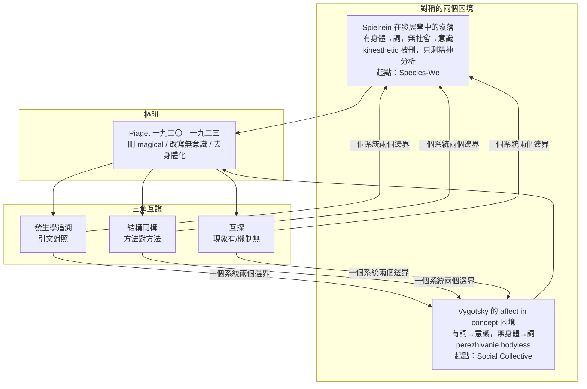
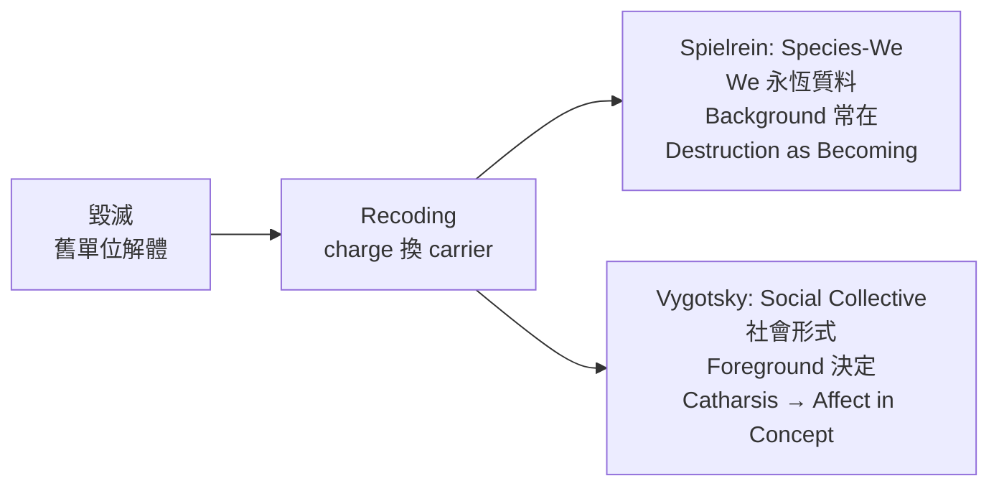
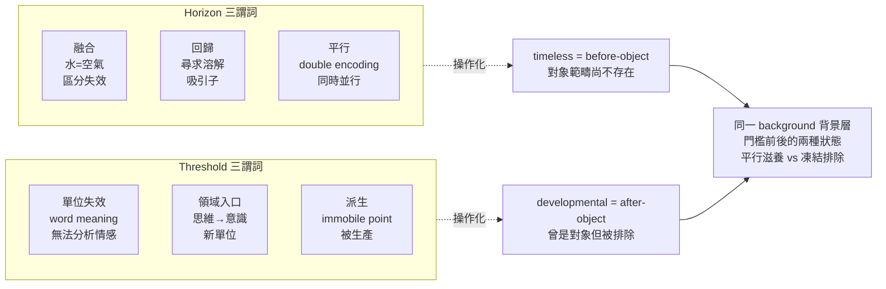
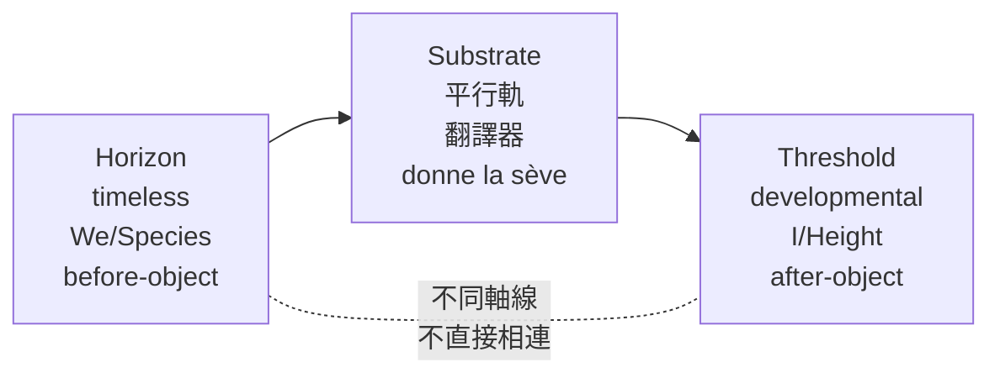

# 地平線與門檻：Spielrein 與 Vygotsky 互補性的文本發生學與結構同構分析

> **方法定位**：比較發生學的結構同構分析（comparative genetic-structural homology），以詞為單位，以《Some Analogies》為對照方法，以四重不變量為判準
> **日期**：2026-08-28

---

## 摘要

本論文重寫 Sabina Spielrein 與 Lev Vygotsky 關係的提問方式。不問兩人是否說了相似的話，而問為何兩人各自留下一個無法自行縫合的缺口，且缺口恰好互為對方的富餘。Spielrein 在發展心理學中的沒落，與 Vygotsky 晚期 affect in concept 的困境，是同一個歷史切斷的兩面。Spielrein 提供了從身體到詞的完整發生學弧線，卻在經由 Jean Piaget 的轉述後，只以精神分析的標籤被記住，發展學的身體—詞機制被抽空；Vygotsky 完成了從詞到意識的建構，卻在 affect in concept 與 perezhivanie 的關口留下 bodyless 的缺口，有公式而無操作。兩者的對稱不是偶然，而是 Piaget 在一九二〇至一九二三年間對中介鏈的主動刪改所致。

本文進一步指出，此一切斷的樞紐在於起點的錯位。Vygotsky 的起點不是詞源學，而是社會集體，自我經由社會集體湧現；Spielrein 的起點則是種—我們（Species-We），自我經由種的溶解與重生而被構成。Piaget 切掉的正是連接此兩種集體性的中介操作。本文以文本發生學追溯證明切斷是引文可驗的事實，以結構同構證明被切斷的兩端共享同一操作與同一詞本體論，以互探證明兩人各自觸及對方的命題卻說不清對方的機制，從而證明切斷而非自足。Horizon 與 threshold 在此重寫中不再是兩條抽象邊界的名稱，而是兩個具體困境的代稱：horizon 指 Spielrein 那個被刪去 kinesthetic 後只剩精神分析的平行滋養層，threshold 指 Vygotsky 那個抵達詞義卻無法將情感縫入概念的門檻。兩者是一個系統的兩個邊界，經由同一背景層的前後狀態與載體鏈的翻譯而互補。

為使哲學外觀的詞彙可驗，本文將 horizon 與 threshold 各提煉為三個謂詞，將 timeless 與 developmental 翻譯為 before-object 與 after-object 的心理操作，並以引文定義背景層。本文並以 Spielrein 的「Destruction as the Cause of Becoming」與 Vygotsky 的 catharsis 為對照，論證 affect in concept 作為 catharsis 之後的出現，三者在同一 recoding 操作下構成發生學的連續。

**關鍵詞**：Spielrein；Vygotsky；Piaget；horizon；threshold；kinesthetic；affect in concept；perezhivanie；catharsis；Destruction as the Cause of Becoming

---

## 導論：從相似性比較到缺口對稱

既有文獻對 Spielrein 與 Vygotsky 的比較，多停留在相似性羅列：兩人都談詞，都談身體，都談無意識。這種比較無法解釋一個更基本的文獻事實：為何 Spielrein 在發展心理學中幾乎消失，只在精神分析史中以「毀滅作為生成之因」被提及；為何 Vygotsky 在晚期明確提出「Freedom: the affect in the concept」與「Spinoza's theory implicite contains the whole acmeistic psychology」，卻始終未能給出 affect 如何進入概念的操作，且 perezhivanie 始終帶有 bodyless 的痕跡。

本論文主張，這兩個現象是同一個歷史切斷的兩面，而切斷的樞紐是 Piaget。Spielrein 在一九二二年《Papa and Mama》中給出的三階段與身體—詞機制，經由 Piaget 一九二三年《La pensée symbolique》的轉述，被刪去中介環節與身體基底，成為去身體化的 egocentric；Vygotsky 在一九三四年經由 Piaget 的鏡片接手 egocentric 並將其翻轉為「the process that leads to the emergence of egocentric speech is the mirror image of that suggested by Piaget」，所接手的已是被抽空的結構概念。於是，Spielrein 有身體而無社會—意識的完成，Vygotsky 有社會—意識而無身體的生成，兩人各自觸及對方的領域，卻各自說不清對方的機制。

此一切斷的深層在於起點的根本差異。Vygotsky 的發生學起點不是詞的詞源，而是社會集體。他的基本律是：「Every function in the child's cultural development appears twice: first, on the social level, and later, on the individual level; first, between people (interpsychological) and then inside the child (intrapsychological)」。詞在此律中是社會互動的中介：「The word is the most direct manifestation of the historical nature of human consciousness. Consciousness is reflected in the word like the sun is reflected in a droplet of water. The word is what — in Feuerbach's words — is absolutely impossible for one person but possible for two」。更精確地，「Communication with another (an interpsychological function) is always eo ipso communication with oneself (i.e., an intrapsychological function): The latter is implicite contained in the first. That is, what is possible for two at the same time becomes possible for one」。自我經由社會集體湧現，詞是此湧現的載體。

Spielrein 的起點則相反，不是社會集體，而是種—我們。她寫道：「I was led to believe that the main characteristic of the individual consists in being a 'dividual' [ein Dividuum]. The closer we get to conscious thinking, the more differentiated our mental representations; the deeper we enter into the unconscious, the more general, more [arche]typal they become. The depth of our psyche knows no 'I,' it only knows its summation, the 'We'; or the current I, viewed as an object, becomes subordinate to other similar objects」。在此，集體不是社會，而是種：「The collective psyche strives to turn the ego-psyche into an impersonal, [arche]typal one」，而生成是「The drowned ego-particle surfaces richer than before, adorned with new representations」。自我經由種的溶解與重生而被構成，詞是此溶解—重生的載體。

Piaget 切掉的，正是連接此兩種集體性的中介操作：magical 作為詞的超額意義與召喚能力，動態無意識作為情感—身體的生成維度，kinesthetic 作為身體基底。切斷後，Vygotsky 的社會集體失去身體的根，Spielrein 的種—我們失去社會的完成。

為論證此一對稱，本文不引入外部哲學，亦不依賴實證測量，而是嚴格運用兩人自己的方法論進行互證。Spielrein 在《Some Analogies》中提出跨領域同律對照，兒童、失語症與夢在同一操作下顯現同一規律；Vygotsky 在《思維與言語》第五章與第七章提出以詞義為單位的發生學分析。以此方法對照兩人的困境，本身即是方法論的自我驗證。論證分三步：發生學追溯以引文證明 Piaget 所刪是文本事實，結構同構以方法對方法證明被切斷的兩端本屬同一操作，互探以現象有而機制無的分布證明切斷而非自足。三者構成三角互證，任一角被證偽則整體推翻。

---

## 第一章 Spielrein 在發展學中的沒落：被刪去的 kinesthetic，只剩精神分析

Spielrein 的發展學貢獻在今日常被誤讀為精神分析的前史，這一誤讀本身即是 Piaget 刪改的後果。回到她的文本，她的起點不是驅力理論，而是詞的發生學。

她在一九二二年《Papa and Mama》中明確給出三階段：「I would distinguish three stages in the development of language: first the autistic stage, in which language exists for its own sake; second is the magical stage, in which a word contains an extra significance which conjures up reality; the third is the present stage of a social language intended for our fellow human beings」。三階段各有心理機制：autistic 階段的詞「the word did not mean an action, it was the action itself」，由身體感覺建成；magical 階段以「the belief in the 'omnipotence of thought'」為核心，詞帶超額意義而能召喚現實；social 階段以同類為對象。這不是階段標籤的羅列，而是身體經由詞到社會的發生學弧線。

身體在此不是比喻，而是操作基底。Spielrein 反覆以 kinesthetic images 定義此層，並以極為具體的意象給出功能：「Subconscious visual–kinetic images nourish [donne la sève] our conscious thoughts. Without them our thought would be uprooted, 'stripped down'」。背景層如樹液之於樹，持續供給汁液，但不直接決定枝葉形態。詞在此層尚未分化為標籤，而是動作的直接延續，後來才經由 magical 的超額意義被社會化。這一弧線使她的理論同時具有發展學與精神分析的雙重身份，毀滅作為生成之因描述的是同一 recoding 操作在情感層面的顯現，而三階段描述的是同一操作在詞層面的顯現。

沒落的機制在於，經由 Piaget 的轉述，發展學的半段被抽空，只剩精神分析的半段被記住。Piaget 在一九二三年《La pensée symbolique》開篇將序列重述為 autistique 經由 égocentrique 到 social，magical 被刪。這不是術語簡化，而是中介操作的刪除，因為 magical 承載的正是詞的超額意義與召喚能力，是連接自體封閉與社會指向的唯一中介。與此同時，Piaget 對無意識的改寫抽空了情感—身體的生成維度，使 Spielrein 原有的 kinesthetic 基底失去理論位置。結果，後世在發展學中記住的 Piaget 是 egocentric 的發現者，而 Spielrein 只在精神分析史中以毀滅本能的前驅被提及，她的 kinesthetic 發生學在發展學正典中消失。這不是影響力的自然衰減，而是中介鏈被切斷後，身體—詞的半段失去載體而無法被傳遞的文獻後果。

---

## 第二章 Vygotsky 的起點：從社會集體湧現自我

Vygotsky 的發生學起點與 Spielrein 形成對照。如果說 Spielrein 從種—我們出發，經由身體—詞走向社會，Vygotsky 則從社會集體出發，經由詞走向自我。他的基本律不是詞源學，而是社會發生學：「Every function in the child's cultural development appears twice: first, on the social level, and later, on the individual level; first, between people (interpsychological) and then inside the child (intrapsychological)」。在此律中，詞不是詞源的遺跡，而是社會互動的中介：「The word is the most direct manifestation of the historical nature of human consciousness」，且「is absolutely impossible for one person but possible for two」。自我不是起點，而是社會互動內化的結果：「Communication with another (an interpsychological function) is always eo ipso communication with oneself (i.e., an intrapsychological function): The latter is implicite contained in the first」。

這一立場使 Vygotsky 對 Piaget 的批判具有發生學的尖銳性。Piaget 將 egocentric speech 視為自體封閉向社會化的過渡，Vygotsky 則將其翻轉為「the process that leads to the emergence of egocentric speech is the mirror image of that suggested by Piaget」，即 egocentric 不是自體的殘餘，而是社會言語向內在言語過渡的關鍵形態。社會不是終點，而是起點；自我不是前提，而是社會互動經由詞內化後的沉積。

然而，正是在此翻轉中，Vygotsky 的困境顯現。他完成了從詞到意識的建構，卻在需要身體—詞機制的關口留下系統性缺口。在《思維與言語》第七章結尾，他將研究帶到門檻：「Our investigation has brought us to the threshold of a problem that is broader... than the problem of thinking. It has brought us to the threshold of the problem of consciousness」。Word meaning 作為概括，作為「word meaning is a microcosm of consciousness」，確實捕捉了思維與詞的統一，且「The word is comparable to the living cell... a unit of sound and meaning」與「word meaning... a unity of generalization and social interaction」給出了詞作為統一載體的本體論。但他緊接著診斷此單位的結構限制：概括無法分析情感，需要把莎士比亞翻譯成概念語言，需要轉向 Spinoza 的 affectus，提出「Freedom: the affect in the concept」與「Spinoza's theory implicite contains the whole acmeistic psychology」，並以「concept = affect = will」的 acmeist 單位作為門檻後的新單位。Threshold 在此同時是單位失效處、領域入口與派生生產線。

他的缺口同樣是明確的。Kinesthetic 一詞在 Vygotsky 文本中僅零星出現，而在 Spielrein 文本中反覆出現；sense 與 body 或 kinesthetic 在《思維與言語》中幾無共現。Vygotsky 唯一的動作理論是語義化的：「The unit of the psychomotor system: the meaningful movement... the unity of meaning and movement」，是意義—運動統一體，而非被感覺的 kinesthetic substrate。情感方向「The affect is overcome by the affect. And the basis is not thinking but desire」全程活在壓縮態，從未在可陳述的機制中完成。這意味著，Vygotsky 有 affect in concept 的公式，卻無 kinesthetic 到詞的操作；有 perezhivanie 作為環境與自我不可分的合成單位——「An emotional experience [perezhivanie] is a unit where, on the one hand, in an indivisible state, the environment is represented... and on the other hand, what is represented is how I, myself, am experiencing this」——卻只有分子態的描述而無身體的生成。Vygotsky 自己將此單位定為分子現象：「Experience is a microscopic, molecular, inner phenomenon in the development of the character」，分子態保留 timeless 痕跡，性格結晶是 developmental 沉積，但中間從 kinesthetic 到詞的載體鏈缺環。Perezhivanie 因此呈現 bodyless 的結構：作為單位，它統合環境與人格——「we are always dealing with an indivisible unity of personal characteristics and situational characteristics」——卻未以 kinesthetic images 為滋養基底，恰與 Spielrein 的「Subconscious visual–kinetic images nourish [donne la sève] our conscious thoughts. Without them our thought would be uprooted, 'stripped down'」形成對照；Vygotsky 的 perezhivanie 有環境—自我的不可分性，卻無身體—詞的生成性。

這一缺口不是能力的不足，而是歷史切斷的痕跡。他經由 Piaget 接手的 egocentric 已是去身體化的結構概念，身體在 Vygotsky 處以直接性在場，卻在生成性上缺席。社會集體的起點因此失去身體的根，正如 Spielrein 的種—我們失去社會的完成。

詞在此呈現兩種存在方式，恰為同一發生學弧線的兩端。Spielrein 所謂「the word did not mean an action, it was the action itself」，指詞在種—我們層次的根部存在：詞尚未分化為標籤，詞與身體動作、與感覺是同一件事，無主客、無時空，即「The sea [das Meer] ('the mother')... is the obscure problem, the state in which there is neither time, nor place, nor opposites... because it is still undifferentiated, not creating the new, therefore an eternal Being [ein ewig seiendes Etwas]」所描述的未分化狀態。Magical 作為「a word contains an extra significance which conjures up reality」與「the belief in the 'omnipotence of thought'」，動態無意識作為「L'inconscient est donc actif... Il y a une barrière entre l'inconscient et la conscience」的情感引擎，kinesthetic 作為「Subconscious visual–kinetic images nourish [donne la sève] our conscious thoughts」的身體基底，皆屬此根部層次，詞即身體，尚未成為社會符號。

Vygotsky 所謂「The word is the end that crowns the deed」，則指詞在社會集體層次的冠部存在。他在《思維與言語》末章引 Goethe 對《聖經》「In the beginning was the word」的改寫「In the beginning was the deed」，再引 Gutsman 的評註：「Gutsman's argument is that the word is a higher stage in man's development than the highest manifestation of action. He is right. The word did not exist in the beginning. In the beginning was the deed. The formation of the word occurs nearer the end than the beginning of development. The word is the end that crowns the deed」。Crowns 在此不是取代，而是加冕、完成：deed 為根，word 為冠，詞不在起點而在發展的近終點才形成，詞不是對行動的標籤，而是對行動的重組與提升，即「The word is comparable to the living cell... a unit of sound and meaning」與「word meaning... a unity of generalization and social interaction」及「word meaning is a microcosm of consciousness」所定義的概括與社會互動的統一。兩者不矛盾，而是同一載體在不同層次上的兩種本體論：前者說詞作為身體，後者說詞作為意識；前者說詞即質料，後者說詞為形式。Vygotsky 自己強調此發生學含義：「The connection between thought and word is not a primal connection that is given once and forever. It arises in development and itself develops」。詞與行動的統一不是前提，而是發展的成就。

Spielrein 未能使詞進入 social 的後果，在其框架中即是詞滯留於 magical：帶「a word contains an extra significance which conjures up reality」，持「the belief in the 'omnipotence of thought'」，未成為可概括、可交流的概念，仍屬「The depth of our psyche knows no 'I,' it only knows its summation, the 'We'」的種—我們，而非 Vygotsky 的「is absolutely impossible for one person but possible for two」的社會集體。詞因此保持私人性與超額性，未能成為意識的微觀宇宙。

---

## 第三章 樞紐：Piaget 所刪為何——中介鏈的切斷是引文可驗的事實

兩人的對稱缺口指向同一個樞紐：Piaget 在一九二〇至一九二三年間對中介鏈的主動刪改。追溯的路徑是 Spielrein 一九二二年《Papa and Mama》經由 Piaget 一九二三年《La pensée symbolique》到 Vygotsky 一九三四年《思維與言語》，三者在文本上可逐句對照。

第一個刪改是階段序列的中介環被抽空。Spielrein 明確給出 autistic 經 magical 到 social 的完整定義，而 Piaget 在《La pensée symbolique》開篇重述時直接以 égocentrique 取代 magical，且未對此刪減作出任何方法論說明。中介環的消失使自體封閉到社會指向之間失去操作，詞的超額意義與 omnipotence of thought 的信念無處安放。Vygotsky 的社會起點因此失去詞的發生學中介，只能以社會互動的內化來直接生成自我，而無法說明詞如何從身體中長出。

第二個刪改是動態無意識被改寫為功能連續體。Piaget 在一九二〇年《精神分析與兒童心理學》中仍完整掌握動態無意識，他寫道：「L'inconscient est donc actif et d'une puissance capable d'influer sur la conscience sans que celle-ci ne s'en doute. Il y a une barrière entre l'inconscient et la conscience」，並指出「les tendances de l'inconscient qui agissent sur la conscience échappent au contrôle de celle-ci; elles passent en effet par une censure préalable qui dissimule leur nature réelle sous le symbolisme de la pensée autistique」，文本中整套「Le refoulement... est un acte volontaire... consistant à empêcher une tendance ou un sentiment de réapparaître dans la conscience」、「C'est là ce qu'on appelle le procédé cathartique」與「Le refoulement réel conduit à la sublimation」俱在。然而同文本後半，他開始自我拆解：「Il convient donc de supprimer l'opposition factice de l'inconscient et de la conscience」，主張「les rapports entre l'activité inconsciente et l'activité consciente sont de simple continuité」，並以「Tout se passe comme si la conscience était une force assimilatrice de l'inconscient」重新定義意識。至一九二三年，改寫完成：他明確拒絕「le symbole est en quelque sorte le produit du refoulement et de la censure」，將其改寫為「la pensée symbolique est une manière primitive ou du moins économique de penser」，主張「Il n'y a pas de différence de nature, mais de degré, de complication, entre ces deux manières de penser」，要求「Que l'on remplace le langage finaliste de ces lignes par un langage causal, ou simplement fonctionnel」，並拒斥「une entité qui sommeillerait dans l'inconscient」。動態無意識的壓抑—審查—宣洩機制被溶為連續性與功能，情感—身體的生成維度隨之脫落。

第三個刪改是身體的去情感化。Piaget 一九二〇年代文本中，身體以 motor schema 與 organic activity 的去情感化寄存器出現，情感被置於外圍如「affective postulate」與「motive-power」，不參與結構生成。這使 Spielrein 的 kinesthetic substrate 在轉述中失去位置，Vygotsky 所接手的 egocentric 因此是去身體化的。

三個刪改共同構成中介鏈的切斷：magical 作為詞的中介操作被刪，動態無意識作為情感引擎被溶，kinesthetic 作為身體基底被抽空。切斷的證據是引文對照，而非學派差異的推論。Vygotsky 的社會集體與 Spielrein 的種—我們因此失去中介，兩種集體性無法互譯。

### Piaget 語言鏈是否完整？——完整性宣稱與雙重批評

此處需回答一個關鍵問題：Piaget 的語言鏈是否自認為完整？答案是肯定的，且正因其自認為完整，切斷才是結構性的而非偶然遺漏。

Piaget 將 egocentrism 作為整個理論的基石：「This is the cornerstone of the entire structure」，「All characteristics of the child's thinking flow from it」。其發生學序列為 autistic → egocentric → socialized/logic，並明確表述為：「Genetically, then, autistic thinking is the first form of thinking. Logic arises comparatively late. Egocentric thought occupies a position between them」，且「all egocentrism is designed by its structure to stand half-way between autistic and socialized thought」。在此框架中，egocentric speech 被賦予量化指標與功能定義：「if it be granted that the first three categories of child language as we have laid them down are egocentric, then the thought of... 54-60 percent」，「The chief function of this egocentric language is, therefore, to serve as an accompaniment to the thought or action of the individual」，且「Egocentric speech is completely subordinated to egocentric motives and nearly incomprehensible to others. It is the child's verbal dream」。其發生學解釋為雙重根源：「in two factors; first (following psychoanalytic theory) in the child's asociality, and, second, in the unique character of his practical activity」，「Now, this activity is unquestionably egocentric and egotistical. The social instinct is late in developing」。最終命運是消亡：「egocentric speech gradually dies off」。Piaget 自己也承認此為假說：「Piaget often says that his position on the intermediate nature of egocentric thought is hypothetical」，但仍以此作為統一解釋 syncretism 等全部兒童邏輯特徵的完整鏈條。形式上，鏈條是閉合的。

Spielrein 的批評從下切斷此完整性。她的序列為 autistic → magical → social，magical 以「the belief in the 'omnipotence of thought'」為核心，且「the word did not mean an action, it was the action itself」。對她而言，Piaget 的 autistique → égocentrique → social 是刪去中介的轉述。Magical 正是連接自體封閉與社會指向的唯一操作，承載詞的超額意義與召喚能力；刪去後，詞如何從身體動作長為社會符號的發生學機制消失，kinesthetic images 作為「Subconscious visual–kinetic images nourish [donne la sève] our conscious thoughts」的滋養基底失去位置。Piaget 同時將動態無意識溶為功能連續體，情感—身體的生成維度隨之脫落。結果是鏈條在形式上完整，在材料上空洞：有中介之名，無中介之實。

Vygotsky 的批評從上翻轉此完整性。其批評不是補充，而是方向翻轉：「the process that leads to the emergence of egocentric speech is the mirror image of that suggested by Piaget」。其基本律是社會起源：「Every function in the child's cultural development appears twice: first, on the social level, and later, on the individual level; first, between people (interpsychological) and then inside the child (intrapsychological)」。據此三點反駁：第一，起點錯誤。Piaget 以兒童 asociality 解釋 egocentrism，Vygotsky 則主張「Social forms of behavior are more complex and develop earlier in the child; becoming individual, they drop to functioning according to simpler laws」，社會是起點而非終點。第二，功能錯誤。Piaget 認為 egocentric speech 無功能、伴隨性、終將消亡；Vygotsky 實驗證明相反：「Our children showed an increase in average levels of egocentric speech in any situation where some difficulty was encountered」，且「Egocentric speech is originally social. It does not fade away, but becomes internal speech. It is internalized」，具有計劃與自我調節功能。第三，命運錯誤。Piaget 的 dies off 被改為內化為 inner speech，成為思維的中介。

兩種批評恰好互補：Spielrein 指其無根——無身體—詞的生成；Vygotsky 指其無源——無社會—詞的內化。所指皆為同一個被切斷的中介鏈。Piaget 試圖以 egocentric 為中介給出從自體到社會的完整發生學，但此中介同時抽空了下的身體生成與上的社會內化。由此可見，切斷並非偶然遺漏，而是在 Piaget 自認為已完成之處的結構性失敗。正是此一失敗位置，使兩種生成理論得以在斷裂的兩端各自發展為替代：Spielrein 的 Destruction as the Cause of Becoming 與 Vygotsky 的 catharsis，正是對同一中介缺口的兩種回答。

---

## 第四章 兩種生成理論的對位：Destruction as the Cause of Becoming 與 Catharsis，及 affect in concept 作為 catharsis 之後

Spielrein 與 Vygotsky 各自提出一種生成理論，兩者在操作上同構，在集體位置上互補，而 Vygotsky 的 affect in concept 則是 catharsis 之後的延續。

Spielrein 在一九一二年《Destruction as the Cause of Becoming》中提出，生成以毀滅為內在環節。她的提問是：「Why does this most powerful drive, the reproductive drive, in addition to the expected positive feelings, harbor negative feelings, such as anxiety and disgust?」她的回答不是道德的，而是發生的：「In this process, the unity of each cell is destroyed, and from the product of this destruction, new life originates」，且「Destruction and reconstruction that always occur in normal circumstances as well, take place in an abrupt manner」。毀滅不是外在的否定，而是新生的內在條件。心理層面亦然：「The drowned ego-particle surfaces richer than before, adorned with new representations」，自我經由溶解而重生，種—我們經由個體的毀滅而更新。此一操作在詞的層面即是三階段的發生學，舊單位被毀，charge 換新 carrier。

Vygotsky 在一九二五年《藝術心理學》中提出 catharsis 作為生成的另一種表述。他的定義是：「To Vygotsky, catharsis is not simply the release of overwhelming affective attractions liberated, through art, from their 'evil qualities.' It is rather the resolution of a certain, merely personal conflict, the revelation of a higher, more general, human truth in the phenomena of life」。其機制是情感的矛盾與形式的克服：「Affective Contradiction and the Beginning of Antithesis. Catharsis. Rejection of the Content of Form」。形式毀滅內容，情感經由形式被重寫，而非被消除。他在此已意識到此公式的未完成：「The disclosure of the content of this formula of art as catharsis must remain outside the scope of this book. ... Before this can be done, further investigations in the areas of the various different arts would be needed」。

兩種生成在操作上同一：皆主張毀滅不是消除，而是 recoding，舊單位被毀，charge 換新 carrier，新生在形式的重寫中湧現。差異在於集體的位置。Spielrein 的集體在下，作為種的質料，timeless 的供料，We 提供質料；Vygotsky 的集體在上，作為社會的形式，developmental 的立法，社會提供形式。Spielrein 的毀滅是種經由個體的自我毀滅而更新，Vygotsky 的 catharsis 是個體經由形式的自我克服而上升。兩者互補為背景與前景。

Affect in concept 則是 catharsis 之後的出現。Vygotsky 在一九三〇年代初的筆記中明確將兩者連為同一機制的延續：「Freedom: the affect in the concept」與「The affect is overcome by the affect. And the basis is not thinking but desire」，以及「Spinoza's theory implicite contains the whole acmeistic psychology」與「To understand the affect is an active condition and is freedom」。如果說 catharsis 是情感經由藝術形式被重寫，那麼 affect in concept 就是情感經由概念形式被重寫。前者處理藝術中的情感轉化，後者處理思維中的情感轉化，兩者共享同一原則：情感不被消滅，而是被 recode 到新形式。此一延續在文本上可驗：Vygotsky 在《藝術心理學》後幾乎不再以 catharsis 為題，卻在筆記中以 Spinoza 的 affectus 重提同一問題，並以「concept = affect = will」的 acmeist 單位作為門檻後的新單位。Catharsis 因此不是被拋棄，而是被翻譯為 affect in concept，從美學的生成理論轉為意識的生成理論。

---

## 第五章 互探：兩人各自觸及對方的命題，卻說不清對方的機制

切斷而非自足的證明，在於互探。所謂互探，指每一端都持有對岸的現象描述，卻缺乏對岸的機制說明。現象的富餘與機制的缺口恰好鏡像，證明被切斷的是一個完整發生學路線的上下半段，而非兩個自足體系的並列。

Vygotsky 對 Spielrein 領域的觸及是多重的，且每一次都伴隨機制的失語。第一次觸及是 Zakharino 報告中的直接給定：「I can directly perceive another person's fear. Mind is the perception of intracorporeal processes」與「my body simultaneously forms part of two series of experience」，身體作為內外交會零點直接在場，極為接近 Spielrein 的 horizon 現象，卻止於直接性，未能說明 kinesthetic 如何成為詞。第二次觸及是分子態 perezhivanie，Vygotsky 自己將此單位定義為「An emotional experience [perezhivanie] is a unit where, on the one hand, in an indivisible state, the environment is represented... and on the other hand, what is represented is how I, myself, am experiencing this」且「we are always dealing with an indivisible unity of personal characteristics and situational characteristics」，並定為分子現象：「Experience is a microscopic, molecular, inner phenomenon in the development of the character」。此一定義觸及了背景層的兩種狀態——分子態保留 timeless 痕跡，性格結晶是 developmental 沉積——卻未能說明分子態如何經由 kinesthetic 到詞的載體鏈被 recoding 為結晶。Vygotsky 的 perezhivanie 有環境—自我的不可分性，卻無身體—詞的生成性，恰與 Spielrein 的「Subconscious visual–kinetic images nourish [donne la sève] our conscious thoughts. Without them our thought would be uprooted, 'stripped down'」形成對照：前者統合環境與人格，後者以 kinesthetic 為滋養基底，兩者互為缺環。第三次觸及是身體內部經驗的組織：「The affect is overcome by the affect. And the basis is not thinking but desire」，觸及情感作為引擎的連續性，卻未能在可陳述機制中完成轉化。每一次觸及都留下現象，每一次都缺乏 kinesthetic 到詞的操作。

Spielrein 對 Vygotsky 領域的觸及同樣多重且同樣失語。她明確命名社會語言的終點：「Spoken language is, above all, a social language」，直接觸及 Vygotsky threshold 所指向的社會—意識領域。她在第十一章提出雙重編碼的平行模型：「Every conscious thought or mental representation content is accompanied by a corresponding unconscious one, which translates the results of conscious thinking into the language of the unconscious」，觸及意識系統的雙軌結構。她也描述詞如何由身體感覺建成，autistic 語言由身體感覺而來。然而，她止於命名，未能說明 word meaning 如何經由概括與系統重組而成為意識的微觀宇宙，更未能說明情感如何被 recode 進概念而成為自由。她的生成止於社會語言的命名，未進入 Vygotsky 所展開的從詞到意識的建構工地。

此處需回答一個常見疑問：Spielrein 似乎並未如 Vygotsky 那樣以社會集體為起點提出問題或任務，為何仍需 social？答案在於，她的三階段本身即以 social 為終點——「the present stage of a social language intended for our fellow human beings」——但此 social 僅是被命名的終點，而非被說明的機制。她能說明詞如何從身體感覺中長出（「the word did not mean an action, it was the action itself」），卻未能說明詞如何經由概括與系統重組而成為意識的微觀宇宙（「word meaning is a microcosm of consciousness」）與社會互動的統一（「a unity of generalization and social interaction」）。更關鍵的是，她的集體是種—我們（Species-We）——「The depth of our psyche knows no 'I,' it only knows its summation, the 'We'」與「The collective psyche strives to turn the ego-psyche into an impersonal, [arche]typal one」——而非 Vygotsky 的社會集體（social collective）——「Every function... appears twice: first, on the social level... between people (interpsychological) and then inside the child (intrapsychological)」。種—我們提供質料的永恆性，社會集體提供形式的歷史性，兩者不是同一集體的重複，而是同一發生學弧線的兩端。Spielrein 有身體到詞的生成，卻無詞到意識的社會完成；Vygotsky 有詞到意識的社會完成，卻無身體到詞的種的根。Social 對 Spielrein 而言不是外加的問題意識，而是她自身弧線的內在完成條件：沒有 Vygotsky 的社會集體，她的身體—詞無法成為概念；沒有她的種—我們，Vygotsky 的社會集體無法獲得身體的滋養。

互探的鏡像分布證明，Vygotsky 的三兄妹分析有社會而無身體，Spielrein 的兒童分析有身體而無社會，合起來即是同一條發生學路線的上下半段。現象的富餘恰是對岸的機制缺口，切斷因此可驗。更重要的是，互探揭示起點的互補：Vygotsky 觸及種—我們的身體基底卻無法以社會集體的語言說明其生成，Spielrein 觸及社會集體的語言終點卻無法以種—我們的語言說明其意識轉化。兩種集體性各自在對方文本中留下痕跡，卻各自缺乏對方的中介。

---

## 第六章 為何哲學—心理學混語可操作化：三謂詞與背景層

Horizon 與 threshold 的哲學外觀常使讀者誤以為必須進入哲學演繹，實則兩詞皆為原文的操作性用語，指涉心理操作失效與轉換之處。本文將各提煉為三個謂詞，使定義逐句可驗。

Spielrein 的 horizon 可提煉為融合、回歸與平行。融合指在 horizon 處水與空氣、上與下、時間與地點的區分失效。她給出的意象是：「I am standing on a lonely stone pier, extending far outwards into a dark sea. At the horizon, the waters of the sea meld with the equally darkly tinted mystical black air」，解讀為伸入暗海即進入暗問題，水與空氣融合象徵母親領域中所有時間地點融為一體、上下無界。她對此的精確定義是：「The sea [das Meer] ('the mother')... is the obscure problem, the state in which there is neither time, nor place, nor opposites... because it is still undifferentiated, not creating the new, therefore an eternal Being [ein ewig seiendes Etwas]」。回歸指已分化表象尋求溶解回原初母親：「In this Ur-mother (the unconscious) all the representations that once differentiated themselves from her seek to be dissolved」，horizon 因此不是牆而是吸引子，Weltschmerz 即由此推導，每個粒子渴望回到原初狀態而新生成在張力中湧現。平行指每個意識思維伴隨無意識對應物，將意識結果翻譯回無意識語言，例為「I’m thinking of my plan to mend a rugged spot」對「I see myself planing a piece of wood」，兩軌同時並行，horizon 是兩軌延伸後相遇之處。綜合三謂詞，horizon 是向後溶解線同時作為源頭，作為永恆存在「simultaneously lives in the present, the past, and the future, i.e., outside of time」而持續滋養當下意識，不是被拋在身後的過去階段，而是平行軌。

Vygotsky 的 threshold 可提煉為單位失效、領域入口與派生。單位失效指 word meaning 作為概括與微觀宇宙在結構上無法分析情感，證據是他在第七章結尾將研究帶到門檻後立即轉向 Spinoza 的 affectus，要求把莎士比亞翻譯成概念語言，這不是材料不足而是單位的結構限制。領域入口指 threshold 同時是一個研究的終點與另一個研究的起點，門檻前是思維與詞、概括與概念形成，門檻後是意識系統包括系統結構、語義結構、情感、意志與自由，需要的新單位是 concept 等於 affect 等於 will 的 acmeist 單位。派生指 Vygotsky 意義的無意識不是先存深度而是被意識發展生產出來的被排除者：「Repression to the unconscious means in the first place exclusion from the general course of development: an immobile point in development. The unconscious does not develop」，且「The relationship consciousness—the unconscious takes shape around the age of seven years. The history of child morals is the history of the basic suppressing agent」，被排除者如月亮般「shines with borrowed light」與「the dream... shines with borrowed light, just like the moon」，門檻是此種無意識的生產線，門檻前無此義的無意識，只有 substrate，門檻後才有。此處需澄清，否定的是 Freud 式的先存深度 Tiefenpsychologie，不等於否定 Spielrein 意義的先存深度即 substrate 與 before-object，兩者是同一背景層前後狀態，並不矛盾。

哲學詞彙向心理操作的翻譯在此完成。Timeless 操作化為 before-object，對象範疇尚不存在的狀態，如 Spielrein 的「there is neither time, nor place, nor opposites... therefore an eternal Being」；developmental 操作化為 after-object，曾是對象但被排除的狀態，如 Vygotsky 的「exclusion from the general course of development: an immobile point」。前者是前範疇的，後者是後範疇的，兩者不是同一區分的兩面，而是不同區分在同一背景層上的前後狀態。

所謂背景層，需特別澄清，因為它最易被誤讀為哲學隱喻或 Freud 式深度。背景層不是隱喻，而是心理操作層，指詞成為概括與概念之前的那個身體—情感基底，功能是滋養前景而非被前景決定。Spielrein 以極具體意象定義它：「Subconscious visual–kinetic images nourish [donne la sève] our conscious thoughts. Without them our thought would be uprooted, 'stripped down'」，如樹液之於樹。前景則是經由詞展開的概括、系統與意識建構，兩者關係不是深度與表面的垂直關係，而是圖與底的關係。Vygotsky 在晚期筆記反覆以 figure-ground 描述高級機能對低級機能的關係，低級機能不是被消滅而是退為背景，以收縮與從屬形式繼續存在於新結構之中。背景層因此不是被超越的過去，而是當下仍在運行的平行軌。

正是在此意義上，Spielrein 的 substrate 與 Vygotsky 的 unconscious 是同一背景層在門檻前後的兩種狀態。門檻前為平行滋養態，常在而非過去；門檻後為凍結排除態，被前景排除而凍結。Timeless 源頭無法直接進入 developmental，必須經由背景層翻譯為 kinesthetic images、affect 等 developmental 產物，再進入詞與意識。

---

## 第七章 如何論證 timeless 與 developmental 同屬一個系統

即使兩端共享操作與載體，timeless 與 developmental 是否根本不可共量，仍是關鍵質疑。本章論證，系統同一性不在階段同一，而在同一背景層的兩種時間體制，且完全可在兩人文本中找到依據。

第一個支點是 Vygotsky 自己已區分兩種時間。文化歷史理論從一開始即建立在自然線與文化線、低級機能與高級機能的區分之上，一人同時擁有兩種時間，這不是後加詮釋而是理論基本架構。既然一人可同時擁有兩種時間，timeless 與 developmental 同屬一個系統便不再矛盾，問題只在兩種時間在系統中的位置。

第二個支點是 substrate 與 unconscious 是同一背景層的前後狀態，而非兩個本體。所謂背景層，指的不是 Freud 式先存深度，而是圖與底關係中的底，是詞成為概括之前的那個身體—情感基底。Spielrein 將此層描述為平行軌，以 donne la sève 滋養意識：「Subconscious visual–kinetic images nourish [donne la sève] our conscious thoughts. Without them our thought would be uprooted, 'stripped down'」，且「simultaneously lives in the present, the past, and the future, i.e., outside of time」；Vygotsky 將同一層的另一種狀態描述為被排除凍結的不動點：「Repression to the unconscious means in the first place exclusion from the general course of development: an immobile point in development. The unconscious does not develop」，且「The relationship consciousness—the unconscious takes shape around the age of seven years. The history of child morals is the history of the basic suppressing agent」，被排除者如月亮般「shines with borrowed light」。前者是門檻前平行滋養態，後者是門檻後凍結排除態，兩者不是兩個並列實體而是同一層前後存在方式。Vygotsky 以 figure-ground 描述此關係，低級機能退為背景以收縮與從屬形式繼續存在。這一區分極清晰，Vygotsky 否定的是 Freud 式先存實體，而非 Spielrein 式平行滋養基底。

第三個支點是翻譯器的存在。Timeless 源頭無法直接進入 developmental，必須經由背景層翻譯為 kinesthetic images 與 affect 等產物，再經由載體鏈身體經聲音、網絡到詞再到概念，每一步皆是 timeless 質料被 developmental 形式 recoding 的過程。沒有翻譯器，horizon 質料無法進入 threshold 建構工地；沒有 horizon 供料，threshold 建構則空轉。

系統同一性在此獲得精確定義：不在階段同一，不在時間體制同一，而在四重不變量。第一，同一載體，詞在兩端皆被否定為外部標籤，Spielrein 的「the word did not mean an action, it was the action itself」與 Vygotsky 的「The word is comparable to the living cell... a unit of sound and meaning」共享同一本體論承諾。第二，同一操作，黏著與雜交在兩端以不同名稱出現，Spielrein 的 perseveration、crossing 與 Vygotsky 的 chain、diffuse、pseudoconcept 是同一發生學操作的不同顯現。第三，同一情感引擎，情感在兩端皆為跨越的操作子，Spielrein 的 affect drives persistence 與 Vygotsky 的「Freedom: the affect in the concept」是同一情感在不同載體上的連續運動。第四，同一背景層的兩種狀態，substrate 與 unconscious 是同一層前後的平行滋養與凍結排除。四重中任一項被證偽，系統同一性即被動搖。

---

## 第八章 結構同構：以兩人的方法證兩人的互補

發生學追溯證明切斷，互探證明切斷而非自足，結構同構則證明被切斷的兩端本屬同一操作，且證明方式本身即是兩人方法的互證。

Spielrein 在《Some Analogies》中提出的方法是跨領域同律對照，兒童、失語症與夢在同一操作下顯現同一規律；Vygotsky 在《思維與言語》第五章提出概念形成經由黏著、複合體到真概念的發生學序列。兩種方法是否同構，本身可檢驗。

同構的第一個層面是中介操作的同一。Spielrein 的 perseveration、crossing、affect drives 與 Vygotsky 的 chain、diffuse、pseudoconcept 在功能上完全對應：perseveration 對 chain 的黏著保持，crossing 對 diffuse 的雜交擴散，affect drives 對 pseudoconcept 中情感對形式的驅動。文本上，Spielrein 對兒童詞彙黏著與情感驅力的描述與 Vygotsky 第五章對複合體思維的描述在操作定義上幾乎可逐句互譯，不是詞彙偶然相似而是同一發生學操作在不同材料上的顯現。

同構的第二個層面是詞本體論的同一。Spielrein 的「the word did not mean an action, it was the action itself」與 Vygotsky 的「The word is comparable to the living cell... a unit of sound and meaning」及「word meaning... a unity of generalization and social interaction」與「word meaning is a microcosm of consciousness」在表面相反，一個強調身體一個強調意識，但在本體論上完全一致：皆否定詞是外部標籤，皆主張詞是意義與情感的統一載體。這一承諾正是四重不變量中同一載體的文本基礎。

結構同構的證明力在於以兩人自己的方法論為判準，避免外部哲學介入。若兩種方法本身同構，則以此方法發現的 horizon 與 threshold 同構便不再是研究者投射，而是方法自我驗證。

---

## 第九章 可證偽性

一個不可證偽的假說不是科學假說，而是信仰。本論文的互補性論證必須給出明確證偽條件，否則三角互證將淪為循環論證。

第一個證偽條件關乎 horizon 的時間體制。若 horizon 被證明是 developmental 而非 timeless，即若「At the horizon, the waters of the sea meld with the equally darkly tinted mystical black air」與「therefore an eternal Being [ein ewig seiendes Etwas]」及「simultaneously lives in the present, the past, and the future, i.e., outside of time」可被重讀為約在特定年齡成形、經由排除而被生產的 developmental 產物，則一個系統兩個邊界的判定退回為一條線的兩端。

第二個證偽條件關乎中介操作的單環可通性。若 magical 單環可同時提供頂與底，即若前意識語言或 magical 的單一操作既能補足 Spielrein 所缺的社會—意識機制，又能補足 Vygotsky 所缺的身體—詞機制，則橋是一環而非整條鏈的判定被推翻。檢驗需回到 Spielrein《Some Analogies》與 Vygotsky 第五章，檢視 perseveration、crossing、chain、diffuse 是否確需多步 recoding。

第三個證偽條件關乎系統性對齊的偶然性。若同一載體、同一操作、同一情感引擎與同一背景層的四重對齊可被證明是研究者後加詮釋而非逐句可驗的同構，則一個系統的判定退回為兩個無關機制。檢驗需回到引文分布，檢視詞作為統一載體的否定外部標籤、黏著與雜交的操作同一、情感作為跨越算子的連續性是否確為兩端共享承諾。

在此框架下，本文對中介鏈的定位得以澄清。中介鏈即 affect 經聲音到網絡再到詞的載體鏈，僅作為一種假說性操作化，用以提供 substrate 經由何種具體操作抵達 threshold 的可檢驗假說，而非三角互證的前提。三角的四重不變量完全不依賴此假說成立，即使中介鏈的具體機制被證偽，只要四重不變量中載體、操作、情感與背景層的同構依然成立，互補性論證依然成立。反之，即使中介鏈被證實，也只是為四重不變量提供更具體實現路徑，而非替代判準。

論文方法段因此可表述為：本研究採用比較發生學的結構同構分析，以詞為單位，遵循 Vygotsky 單位分析原則，以 Spielrein《Some Analogies》為對照方法，以四重不變量為判準。發生學追溯以引文對照證明中介鏈切斷是文本事實，結構同構以方法對方法證明中介操作同一，互探以現象與機制分離證明切斷而非自足。判準可證偽，若 horizon 被證為 developmental 或中介操作被證為單環可通，則推翻一個系統兩個邊界的判定。

---

## 結論：一個系統，兩個邊界，螺旋互補

本論文從兩個對稱的困境出發，經由 Piaget 所刪的引文重建、互探的鏡像分布、兩種集體性的對位、Destruction 與 catharsis 的發生學連續、三謂詞與背景層的操作化、同一背景層兩種時間體制的論證與結構同構的互證，回到一個簡潔判定。Spielrein 在發展學中的沒落與 Vygotsky 的 affect in concept 困境，是同一個系統被切為兩個邊界的後果。Horizon 指那個被刪去 kinesthetic 後只剩精神分析的平行滋養層，threshold 指那個抵達詞義卻無法將情感縫入概念的門檻。兩者分處不同軸線，經由背景層的翻譯而互補。

互補不是靜態拼接，而是螺旋合成。Horizon 的循環提供一輪材料，經由 substrate 翻譯為 kinesthetic images 與 affect，再經由 threshold 駕馭被 recode 為「Freedom: the affect in the concept」，新形式成為下一輪分化起點，再尋 horizon 溶解。Vygotsky 的發展本就是螺旋而非直線，Spielrein 的生成本就是毀滅作為生成之因的循環，兩者的互補在螺旋中完成。人作為 dividuum 即分割體，不是實體而是戰場，We 提供質料，I 提供形式，perezhivanie 是每一圈螺旋的結晶，身體同時屬於兩個經驗系列，內與外交會於零點。

方法論上，本文證明一種不依賴外部哲學與實證測量的互證路徑。以兩人自己的方法論證兩人互補，以詞為單位，以引文可驗為判準，以可證偽為約束，這一路徑本身即是對 Vygotsky 與 Spielrein 方法論自覺的繼承。中介鏈作為假說性操作化為後續研究提供具體接口，但論文主體同一性判準在於四重不變量，即使中介模型具體形式變化，互補結構依然可被檢驗。

最終，horizon 與 threshold 的互補性不在於說了相同的話，而在於以不同語言觸及同一個發生學事實。詞既是行動本身也是意識微觀宇宙，情感既是驅力也是自由，背景層既是平行滋養也是凍結排除，社會集體與種—我們在載體鏈的翻譯中成為同一個系統的不同顯現。一個系統，兩個邊界，經由中介鏈螺旋互補，這即是對 Spielrein 與 Vygotsky 未竟對話的重建。

---

## 參考文獻

Spielrein, S. (1912). Die Destruktion als Ursache des Werdens. *Jahrbuch für psychoanalytische und psychopathologische Forschungen*, 4, 465–503.

Spielrein, S. (1922). Die Entstehung der kindlichen Worte Papa und Mama. *Imago*, 8, 345–362.

Spielrein, S. (1923). Some analogies between thinking in children, aphasia and the unconscious. *British Journal of Psychology* (節譯).

Piaget, J. (1920). La psychanalyse et la psychologie de l'enfant. *Journal de Psychologie*.

Piaget, J. (1923). La pensée symbolique et la pensée de l'enfant. *Archives de Psychologie*, 18, 275–304.

Vygotsky, L. S. (1925/1971). *The Psychology of Art*. Cambridge, MA: MIT Press.

Vygotsky, L. S. (1934/1987). *Thinking and Speech*. In *The Collected Works of L. S. Vygotsky, Vol. 1*. New York: Plenum.

Vygotsky, L. S. (2018). *Vygotsky's Notebooks: A Selection* (Zavershneva & van der Veer, Eds.). Singapore: Springer.

---

*本文為獨立學術論文，引文皆為原文直引。*
